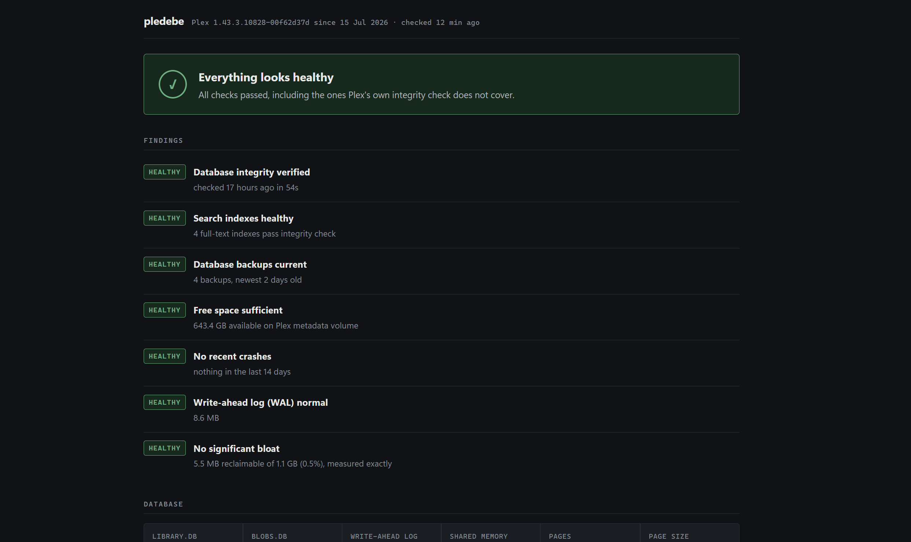
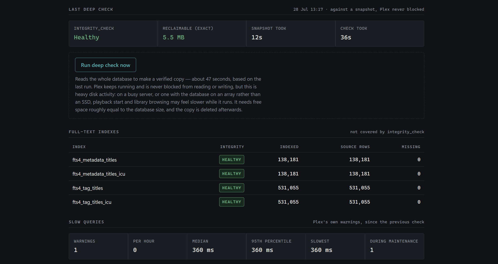

# pledebe

**Watch your Plex database before it breaks.**

Plex databases fail quietly. Search stops returning results, adding an item to a
collection starts throwing errors, the library balloons to tens of gigabytes, an
unclean shutdown corrupts a page. You usually find out weeks later, and by then
you have no idea when it started.

pledebe checks continuously, tells you plainly whether anything is wrong, and
keeps the history that answers *when did this begin*.

It is **read-only**. It never writes to your Plex database. When something needs
repairing it points you at [DBRepair](https://github.com/ChuckPa/DBRepair),
which is excellent at that job.



---

## What it checks

| Check | Why it matters |
|---|---|
| `PRAGMA integrity_check` | SQLite's own verdict on whether the file is damaged |
| **Full-text search indexes** | These corrupt *while the standard integrity check passes*. The symptom is adding to a collection or editing metadata failing — search keeps working, so it goes unnoticed for months |
| Backup freshness | Plex's scheduled backup failing silently is common, and nobody notices until they need it |
| Free space | A repair needs roughly 3× the database size; running out partway through is the worst possible outcome |
| Database size and bloat | Measured exactly, from a snapshot — not estimated |
| Slow queries | Plex logs these itself; pledebe counts them and separates scheduled-maintenance noise from the rest |
| Crashes | With the last crash log, so you can see what actually happened |
| Write-ahead log, page geometry, Plex version history | Context for everything above |

The integrity work runs against a `VACUUM INTO` snapshot, so **Plex is never
blocked** — no stopping the server, no locked library. On a 1.1 GB database the
whole thing takes about ten seconds.

---

## Requirements

- **Plex running in Docker.** pledebe needs Plex's own SQLite build, and today
  the only way to obtain it is copying it out of a running Plex container.
  Native installs — Windows, Synology SPK, QNAP QPKG, TrueNAS CORE jails —
  are not supported yet.
- Docker on the same host as Plex.
- Read access to the Plex config directory.

Works with **hotio, linuxserver, plexinc and binhex** images, on Unraid, TrueNAS
SCALE, OMV, bare Linux or Docker Desktop. Published for `amd64`, `arm64` and
`armv7`.

---

## Install

### 1. Extract Plex's SQLite

One command, once. pledebe needs the whole directory, not just the binary —
`Plex SQLite` will not run without its siblings.

```bash
docker cp plex:/usr/lib/plexmediaserver ./plexbin
```

**hotio images keep it elsewhere:**

```bash
docker cp plex:/app/bin/usr/lib/plexmediaserver ./plexbin
```

Not sure which you have? This finds it:

```bash
docker exec plex sh -c "find / -xdev -type f -name 'Plex SQLite' 2>/dev/null"
```

### 2. Run it

```bash
cp .env.example .env   # edit the paths for your setup
docker compose up -d
```

Then open `http://your-host:8080`.

`PUID=99 PGID=100` is the Unraid convention (`nobody:users`). Most other systems
want `1000:1000`, which is the default.

### Without compose

The minimum that works:

```bash
docker run -d --name pledebe -p 8080:8080 -e PUID=99 -e PGID=100 -v "/path/to/plex/config:/plexconfig:ro" -v ./plexbin:/plexbin:ro -v ./data:/data ghcr.io/simonbrooker/pledebe:latest
```

The same thing with everything worth setting — backup checking, a password, and
the schedule. Drop any line that does not apply to you:

```bash
docker run -d --name pledebe --restart unless-stopped -p 8080:8080 -e PUID=99 -e PGID=100 -e TZ=Europe/London -e PLEDEBE_USER=admin -e PLEDEBE_PASSWORD=change-me -e PLEX_BACKUP_DIR=/plexbackups -e SCAN_INTERVAL=15m -e DEEP_CHECK_HOUR=4 -e PLEDEBE_RETAIN=336h -v "/path/to/plex/config:/plexconfig:ro" -v ./plexbin:/plexbin:ro -v "/path/to/plex/backups:/plexbackups:ro" -v ./data:/data ghcr.io/simonbrooker/pledebe:latest
```

Every variable is explained in [Configuration](#configuration) below, and
`.env.example` lists them all with their defaults.

### Where is my Plex config directory?

The one containing `Plug-in Support`. pledebe searches for the database rather
than assuming a layout, so pointing it at a parent directory also works.

| Setup | Path |
|---|---|
| hotio | `/mnt/user/appdata/plex` |
| linuxserver, plexinc | `/mnt/user/appdata/plex/Library/Application Support/Plex Media Server` |
| binhex | `/mnt/user/appdata/binhex-plex/Plex Media Server` |

---

## Configuration

### Volumes

| Mount | Purpose | Notes |
|---|---|---|
| `/plexconfig` | Your Plex config directory | **Mount read-only** (`:ro`) |
| `/plexbin` | The `plexmediaserver` directory from step 1 | Read-only |
| `/data` | pledebe's own history database | The only writable mount |
| `/plexbackups` | *Optional.* Where Plex writes database backups | Read-only. See below |

### Environment variables

| Variable | Default | What it does |
|---|---|---|
| `PUID` / `PGID` | `1000` | Ownership for `/data`. Unraid users want `99` / `100` |
| `TZ` | `Etc/UTC` | Affects the deep-check schedule and displayed times |
| `SCAN_INTERVAL` | `15m` | How often the cheap checks run |
| `DEEP_CHECK_HOUR` | `4` | Hour of day (0–23) for the daily integrity check |
| `PLEDEBE_RETAIN` | `336h` | How long detailed samples are kept. Daily history is kept forever (~0.8 MB/year) |
| `PLEDEBE_ADDR` | `:8080` | Listen address **inside** the container. To serve on a different host port, change the left side of the ports mapping instead — `"8087:8080"` |
| `PLEDEBE_USER` | *(unset)* | Enables HTTP basic auth when set with the password below |
| `PLEDEBE_PASSWORD` | *(unset)* | See [Security](#security) |
| `PLEX_CONFIG` | `/plexconfig` | Only change if you mount somewhere else |
| `PLEX_SQLITE_DIR` | `/plexbin` | Only change if you mount somewhere else |
| `PLEX_BACKUP_DIR` | *(unset)* | Set to `/plexbackups` if you mount backups |

### Checking backup freshness

Plex can be configured to write database backups anywhere, and it records that
path in *its own* container namespace — which pledebe cannot see. Without this
mount, backup status is reported as **unknown**, never as a failure.

Find where Plex writes them:

```bash
docker exec plex sh -c "tr ' ' '\n' < /config/Preferences.xml | grep -i butlerdatabase"
```

Then map the matching host directory to `/plexbackups` and set
`PLEX_BACKUP_DIR=/plexbackups`.

---

## Using it

The page shows one verdict at the top, findings ordered by severity, then every
measurement grouped below. It refreshes on its own and uses no JavaScript.



**Run a check on demand** with the button on the page, or from the command line:

```bash
docker exec pledebe pledebe -deep
```

**One-off report without installing anything permanent:**

```bash
docker run --rm -v "/path/to/plex/config:/plexconfig:ro" -v ./plexbin:/plexbin:ro ghcr.io/simonbrooker/pledebe:latest -once
```

---

## Security

pledebe exposes your Plex file paths and database details, and has a button that
makes the server read your entire database. **Do not port-forward it.**

It is designed for a private network. If it is reachable by anything you do not
control, set `PLEDEBE_USER` and `PLEDEBE_PASSWORD`, or put it behind an
authenticating reverse proxy. It logs a warning at startup if it is listening on
all interfaces with no credentials.

Your Plex token is never read, logged or displayed — `Preferences.xml` is parsed
with an explicit allowlist, and crash logs are redacted before display.

Full review in [docs/security.md](docs/security.md).

---

## How trustworthy are the results?

An unusual promise for a monitoring tool: **it would rather say "unknown" than
guess.** If pledebe cannot see your backup directory, it says so instead of
reporting a failure.

That came from experience. During development, seven alarming-looking numbers
were investigated on a completely healthy server, and every one turned out to be
a measurement error or a harmless quirk. The eighth was real — corrupt search
indexes, invisible to Plex's own integrity check, fixed with DBRepair's Reindex
and verified afterwards.

Which thresholds are grounded in evidence and which are still judgement calls is
documented honestly in [docs/thresholds.md](docs/thresholds.md).

---

## Documentation

- [docs/thresholds.md](docs/thresholds.md) — what counts as healthy, and where each number came from
- [docs/signals.md](docs/signals.md) — which checks were rejected during calibration, and why
- [docs/platforms.md](docs/platforms.md) — per-platform paths and portability
- [docs/security.md](docs/security.md) — OWASP Top 10 review
- [docs/design-notes.md](docs/design-notes.md) — roadmap and original spike results

## Credit

[DBRepair](https://github.com/ChuckPa/DBRepair) by ChuckPa does the actual
repairing, and its documentation is the reason pledebe checks full-text indexes
at all. If pledebe finds something, DBRepair is what fixes it.

## Licence

MIT — see [LICENSE](LICENSE).
